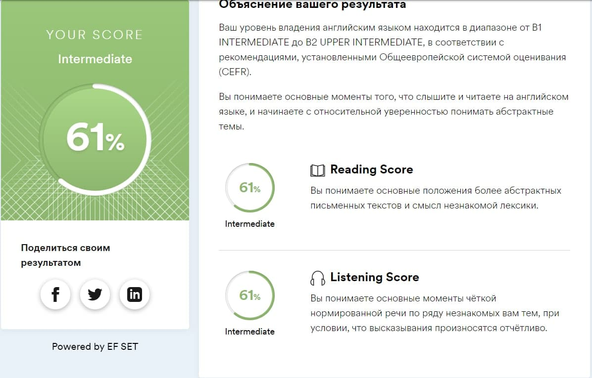

# __Olesya Beinya__


#### _Junior Frontend Developer_
---
__Contact information:__  

 __e-mail:__ olesia-mkf@yandex.ru  

 __phone:__ +375 44 568 99 97

 __telegram:__ @blackmalina
***
__About myself:__

My acquaintance with programming happened about 2 years ago. I was wondering how websites are created. In my free time from my main job, I graduated from web design courses, also watched some lessons on youtube. While developing website design, I became interested in how my projects are translated into code. So I found a layout course and continued the process of self-education. I really like writing code, because I can immediately see the result of my work. I am very glad that by trial and error, I finally found exactly what I like to do and get incredible pleasure from it.
My goal is to study a new, interesting profession that gives unlimited opportunities for development and become a good Frontend Developer in the near future. And I believe that I will succeed.

My goal is to become a frontend developer. And this means having fun at work and, due to the global changes in everyday life due to the pandemic, the opportunity to work remotely.
My strengths are:
- independence;
- perseverance;
- honesty;
- hard work;
- responsibility;
- tolerance;
- able to see the positive, learn from failures and follow on.
***
Skills and Proficiency:__
- HTML5, CSS3
- JS Basics
- Git, GitHab
- VS Code
- Figma, Illustrator
***
__Code example__
JavaScript
```
for (let i = 0; i < 2; i++) {
    const a = prompt('Один из последних просмотренных фильмов?', ''),
          b = prompt('На сколько оцените его?', '');
      personalMovieDB.movies[a] = b;
      
    if (a !=null && b !=null && a != '' && b !='' && a.length < 50) {
        personalMovieDB.movies[a] = b;
        console.log ('Done');
    }  else {
        console.log('error');
        i--;
    }
}
```
***
__Courses__
- HTML Academy cours HTML/CSS
- RS Schools Course «JavaScript/Front-end» (in progress)
- ITMO University, web programming course
***
__Language__ 
- English - Intermediate
- Russian - Native



> My goal at the moment is to level up my English
